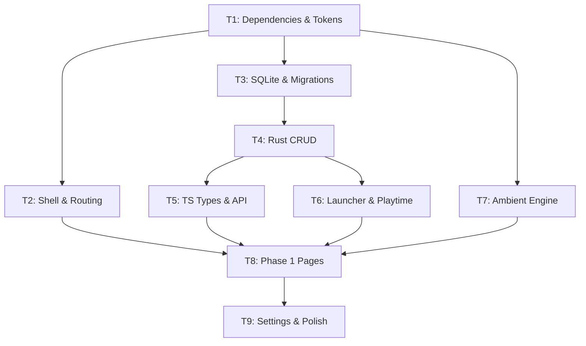

# Pirate Harbor — Phase 1 Implementation Plan

> **Product:** Pirate Harbor
> **Design System:** Atlas OS (see `Design/` folder — single source of truth for all UI/UX)
> **Repository:** `https://github.com/sigmakiller/Pirate-Harbor.git`
> **Commit convention:** `feat: T<N> - <Description>`

---

## Decisions (Locked)

| Decision | Answer |
|----------|--------|
| Tailwind | v4 (CSS-first) |
| Discovery | Watched folders (Phase 1B) |
| Metadata | Manual first, API in Phase 1B |
| Platform | Windows-first |
| Design | Atlas OS — `Design/` folder is authoritative |

---

## Design Authority

**The `Design/` folder is the single source of truth for all visual and interaction decisions.** This implementation plan does not redefine appearance. The Engineer must consult these documents directly:

| Document | Governs |
|----------|---------|
| `DESIGN(1).md` | Vision, principles, golden rule |
| `colors.md` | Color palette, ambient rules |
| `typography.md` | Font families, type scale |
| `spacing.md` | Grid, margins, gutters, whitespace |
| `layouts.md` | Page structure template |
| `COMPONENTS.md` | Cards, buttons, icons, page anatomy |
| `MOTION.md` | Animation durations, allowed/forbidden effects |
| `AMBIENT_SYSTEM.md` | Contextual immersion pipeline |
| `interactions.md` | Hover, click, transition behavior |
| `iconography.md` | Icon library, stroke weight, usage rules |
| `branding.md` | Tone, positioning, language |
| `illustrations.md` | Artwork usage rules |
| `accessibility.md` | Contrast, keyboard, screen readers, motion |
| `sounds.md` | UI audio guidelines |
| `Pages/*.md` | Per-page specifications |

---

## Ambient Layer Architecture

Every page in Pirate Harbor renders as a three-layer stack. The UI itself never changes — only the ambient layer changes.

```
┌─────────────────────────────────────────────┐
│  Layer 3: Monochrome UI                     │
│  (sidebar, navigation, cards, typography)   │
│  Always identical. Never recolored.         │
├─────────────────────────────────────────────┤
│  Layer 2: Contextual Ambient Layer          │
│  (Game Detail pages ONLY)                   │
│  Generated from game artwork.               │
│  Pipeline: extract → desaturate → darken    │
│  → blur → overlay at 8–15% opacity          │
├─────────────────────────────────────────────┤
│  Layer 1: Pure Black OS Background          │
│  #050505 — always present, never changes    │
└─────────────────────────────────────────────┘
```

On non-detail pages (Library, Settings, Onboarding), Layer 2 is absent — the monochrome UI sits directly on the pure black background.

On Game Detail pages, the Ambient Engine generates Layer 2, creating contextual immersion without recoloring any UI element.

---

## Frontend Architecture

```
src/
├── layouts/
│   └── AppLayout.tsx              # Persistent shell (sidebar + top bar + content)
├── pages/
│   ├── LauncherPage.tsx           # Phase 1 — home/launcher
│   ├── LibraryPage.tsx            # Phase 1 — archive library
│   ├── GameDetailPage.tsx         # Phase 1 — with ambient layer
│   ├── AddGamePage.tsx            # Phase 1 — manual game entry
│   ├── SettingsPage.tsx           # Phase 1 — system configuration
│   ├── OnboardingPage.tsx         # Phase 1 — first-run flow
│   ├── CollectionsPage.tsx        # Scaffolded — deferred
│   ├── JournalPage.tsx            # Scaffolded — deferred
│   ├── MilestonesPage.tsx         # Scaffolded — deferred
│   └── IdentityPage.tsx           # Scaffolded — deferred
├── components/
│   ├── Sidebar.tsx                # Persistent navigation
│   ├── TopBar.tsx                 # Persistent top bar
│   ├── GameCard.tsx               # Library game card
│   ├── GameListRow.tsx            # Library list-view row
│   ├── SearchBar.tsx              # Search input
│   ├── FilterBar.tsx              # Filter controls
│   ├── FilePickerButton.tsx       # Tauri native file dialog
│   └── AmbientLayer.tsx           # Renders the contextual ambient overlay
├── engine/
│   └── ambient.ts                 # Ambient Engine — color extraction & processing
├── stores/
│   ├── useLibraryStore.ts         # Library UI state (search, filters, view mode)
│   └── useSettingsStore.ts        # Persisted settings cache
├── lib/
│   ├── api.ts                     # Typed Tauri invoke wrappers
│   └── utils.ts                   # Formatting utilities
└── index.css                      # Tailwind v4 + design tokens
```

---

## Phase 1 Scope

### Implemented (Full)

| Page | Design Spec |
|------|-------------|
| Launcher (home) | `Pages/launcher.md` |
| Archive Library | `Pages/library.md` |
| Game Detail | `Pages/game.md` + `AMBIENT_SYSTEM.md` |
| Add Game | — (manual entry form) |
| System Configuration | `Pages/settings.md` |
| Onboarding | `Pages/onboarding.md` |

### Scaffolded (Route + placeholder, no implementation)

| Page | Design Spec | Deferred To |
|------|-------------|-------------|
| Collections | `Pages/collections.md` | Phase 2 |
| Journal | `Pages/journal.md` | Phase 2 |
| Milestones | `Pages/milestones.md` | Phase 3 |
| Identity | `Pages/identity.md` | Phase 4 |

---

## Task Breakdown

---

### Task 1 — Frontend Dependencies & Tooling

**Objective:** Install dependencies, configure Tailwind v4, establish design tokens as CSS custom properties from `Design/colors.md`, `Design/typography.md`, and `Design/spacing.md`.

#### [MODIFY] [package.json](file:///d:/PirateHarbor/apps/desktop/package.json)

Dependencies: `react-router-dom`, `zustand`, `lucide-react`, `clsx`, `tailwind-merge`
Dev dependencies: `tailwindcss`, `@tailwindcss/vite`

#### [MODIFY] [vite.config.ts](file:///d:/PirateHarbor/apps/desktop/vite.config.ts)

Register `@tailwindcss/vite` plugin. Add `resolve.alias` for `@/` → `./src/`.

#### [NEW] `apps/desktop/src/index.css`

Tailwind v4 entry point. Define CSS custom properties that map 1:1 to the values in `Design/colors.md`, `Design/typography.md`, `Design/spacing.md`, and `Design/MOTION.md`. Import fonts: Inter, JetBrains Mono, Space Grotesk.

#### [MODIFY] [main.tsx](file:///d:/PirateHarbor/apps/desktop/src/main.tsx) — import `index.css`
#### [MODIFY] [index.html](file:///d:/PirateHarbor/apps/desktop/index.html) — title, fonts, meta
#### [MODIFY] [tsconfig.json](file:///d:/PirateHarbor/apps/desktop/tsconfig.json) — `@/*` path alias

**Commit:** `feat: T1 - Frontend dependencies and design token setup`
**Verify:** `pnpm install` + `pnpm --filter desktop dev` starts without errors.

---

### Task 2 — App Shell, Routing & Navigation

**Objective:** Build the persistent layout shell per `Design/layouts.md` and `Design/COMPONENTS.md`. Set up routing for all Phase 1 pages plus scaffolded deferred pages.

#### [NEW] `apps/desktop/src/layouts/AppLayout.tsx`

Persistent shell: sidebar (left) + top bar + main content area (`<Outlet />`).
Conforms to `Design/layouts.md`: "Sidebar and Top Bar are immutable across the application."

#### [NEW] `apps/desktop/src/components/Sidebar.tsx`

Navigation per `Design/COMPONENTS.md` ("Sidebar is persistent").
Links: Launcher, Library, Collections*, Journal*, Milestones*, Identity*, Settings.
(*deferred pages still appear in nav for architectural completeness)
Icons per `Design/iconography.md`. Interactions per `Design/interactions.md`.

#### [NEW] `apps/desktop/src/components/TopBar.tsx`

Persistent top bar per `Design/COMPONENTS.md` and `Design/layouts.md`.

#### [MODIFY] [App.tsx](file:///d:/PirateHarbor/apps/desktop/src/App.tsx)

React Router:
- `/` → LauncherPage
- `/library` → LibraryPage
- `/library/:id` → GameDetailPage
- `/library/add` → AddGamePage
- `/settings` → SettingsPage
- `/onboarding` → OnboardingPage
- `/collections` → CollectionsPage (scaffolded)
- `/journal` → JournalPage (scaffolded)
- `/milestones` → MilestonesPage (scaffolded)
- `/identity` → IdentityPage (scaffolded)

#### [DELETE] [App.css](file:///d:/PirateHarbor/apps/desktop/src/App.css)

#### Placeholder pages (all of them):

Each renders: editorial H1 title per `Design/typography.md` scale + "Coming soon" body text. Deferred pages additionally show a muted label.

- [NEW] `apps/desktop/src/pages/LauncherPage.tsx`
- [NEW] `apps/desktop/src/pages/LibraryPage.tsx`
- [NEW] `apps/desktop/src/pages/GameDetailPage.tsx`
- [NEW] `apps/desktop/src/pages/AddGamePage.tsx`
- [NEW] `apps/desktop/src/pages/SettingsPage.tsx`
- [NEW] `apps/desktop/src/pages/OnboardingPage.tsx`
- [NEW] `apps/desktop/src/pages/CollectionsPage.tsx` (scaffolded)
- [NEW] `apps/desktop/src/pages/JournalPage.tsx` (scaffolded)
- [NEW] `apps/desktop/src/pages/MilestonesPage.tsx` (scaffolded)
- [NEW] `apps/desktop/src/pages/IdentityPage.tsx` (scaffolded)

**Commit:** `feat: T2 - App shell, routing, and navigation`
**Verify:** App launches, all routes reachable, sidebar navigation works, shell matches `Design/layouts.md`.

---

### Task 3 — SQLite Database & Rust Migrations

**Objective:** Create the persistence layer.

#### [MODIFY] [Cargo.toml](file:///d:/PirateHarbor/apps/desktop/src-tauri/Cargo.toml)

Add: `rusqlite` (bundled), `uuid` (v4), `chrono` (serde)

#### [NEW] `apps/desktop/src-tauri/src/db/mod.rs`

`init_db()`, `run_migrations()`, `DbState` (Mutex<Connection>)

#### [NEW] `apps/desktop/src-tauri/src/db/migrations.rs`

Tables: `games`, `sessions`, `settings` + indexes. Schema identical to previous plan revision (no changes — this is engineering, not design).

#### [MODIFY] [lib.rs](file:///d:/PirateHarbor/apps/desktop/src-tauri/src/lib.rs)

Initialize DB in `Builder::setup()`, `.manage(DbState)`.

**Commit:** `feat: T3 - SQLite database schema and migrations`
**Verify:** `cargo build`, app creates DB with tables.

---

### Task 4 — Rust CRUD Commands

**Objective:** Expose Tauri IPC commands for game management and settings.

#### [NEW] `apps/desktop/src-tauri/src/models.rs`

`Game`, `NewGame`, `UpdateGame`, `Session`, `GameFilters`

#### [NEW] `apps/desktop/src-tauri/src/commands/mod.rs`
#### [NEW] `apps/desktop/src-tauri/src/commands/games.rs`

`get_all_games`, `get_game`, `add_game`, `update_game`, `delete_game`, `toggle_favorite`

#### [NEW] `apps/desktop/src-tauri/src/commands/settings.rs`

`get_setting`, `set_setting`, `get_all_settings`

#### [MODIFY] [lib.rs](file:///d:/PirateHarbor/apps/desktop/src-tauri/src/lib.rs)

Register commands.

**Commit:** `feat: T4 - Game CRUD and settings commands`
**Verify:** `cargo build` + `cargo test`.

---

### Task 5 — TypeScript Types & API Layer

**Objective:** Create the frontend contract.

#### [MODIFY] [index.ts](file:///d:/PirateHarbor/packages/shared/index.ts)

`Game`, `NewGame`, `UpdateGame`, `Session`, `GameStatus`, `GameFilters`

#### [NEW] `apps/desktop/src/lib/api.ts`

Typed `invoke()` wrappers for all commands (games, settings, launcher, sessions).

#### [NEW] `apps/desktop/src/lib/utils.ts`

`cn()`, `formatPlaytime()`, `formatDate()`, `formatRelativeDate()`

**Commit:** `feat: T5 - TypeScript types and API bindings`
**Verify:** `pnpm tsc --noEmit`.

---

### Task 6 — Launcher & Playtime Tracking (Rust)

**Objective:** Game process spawning, monitoring, and session recording.

#### [MODIFY] [Cargo.toml](file:///d:/PirateHarbor/apps/desktop/src-tauri/Cargo.toml)

Add: `sysinfo`, `tokio` (full)

#### [NEW] `apps/desktop/src-tauri/src/commands/launcher.rs`

`launch_game(id)` — spawn process, create session, background `tokio::spawn` monitor (poll `sysinfo` every 5s). On exit: finalize session, update game stats, emit `game-stopped` event.

`get_running_game()` → `Option<String>`

`LauncherState` — tracks running game ID + PID.

#### [NEW] `apps/desktop/src-tauri/src/commands/sessions.rs`

`get_sessions(game_id)` → `Vec<Session>`

#### [MODIFY] [lib.rs](file:///d:/PirateHarbor/apps/desktop/src-tauri/src/lib.rs)

Register commands, manage `LauncherState`.

**Commit:** `feat: T6 - Game launcher and playtime tracking engine`
**Verify:** `cargo build`, manual test with Notepad.

---

### Task 7 — Ambient Engine

**Objective:** Build the frontend module responsible for generating the contextual ambient layer per `Design/AMBIENT_SYSTEM.md`.

#### [NEW] `apps/desktop/src/engine/ambient.ts`

The Ambient Engine. Responsibilities:
1. **Extract** dominant color from a game's cover artwork (canvas-based color sampling)
2. **Desaturate** by ~70%
3. **Darken** by ~50%
4. **Generate** a blurred radial gradient overlay
5. **Animate** transitions between games (fade at layout duration per `Design/MOTION.md`)

Exports: `extractDominantColor(imageSrc)`, `generateAmbientStyle(color)`, `AmbientConfig`

#### [NEW] `apps/desktop/src/components/AmbientLayer.tsx`

React component that renders Layer 2. Accepts a `coverPath` prop.
- Loads image → passes to Ambient Engine → renders as a positioned CSS overlay
- Opacity: 8–15% per `Design/AMBIENT_SYSTEM.md`
- Transition: fade at 300ms (layout duration)
- Renders `null` when no cover is provided (non-detail pages)

The component never touches Layer 3 (the UI). It sits between Layer 1 (background) and Layer 3 (content) in the DOM z-index stack.

**Commit:** `feat: T7 - Ambient Engine and contextual immersion layer`
**Verify:** Provide a test cover image → ambient overlay renders on Game Detail, does NOT appear on Library or Settings.

---

### Task 8 — Phase 1 Pages (Full Implementation)

**Objective:** Implement all Phase 1 pages. Each page conforms to its Design spec — the Engineer reads the referenced design doc, not this plan, for appearance decisions.

#### [NEW] `apps/desktop/src/stores/useLibraryStore.ts`

Zustand: `searchQuery`, `filters`, `viewMode`, `sortBy`, `sortOrder`

#### [MODIFY] `apps/desktop/src/pages/LauncherPage.tsx`

**Design spec:** `Pages/launcher.md`
Sections: Continue Journey (last played game as hero), Recent Activity. One hero game dominates.

#### [MODIFY] `apps/desktop/src/pages/LibraryPage.tsx`

**Design spec:** `Pages/library.md`
Editorial title. Large game covers. Minimal metadata. Search + filters. Grid/list toggle.

#### [NEW] `apps/desktop/src/components/GameCard.tsx`

Per `Design/COMPONENTS.md`: flat, thin border, no gradients, no shadows.
Per `Design/interactions.md`: hover = opacity + subtle border.
Per `Design/iconography.md`: Lucide monochrome icons for favorite.

#### [NEW] `apps/desktop/src/components/GameListRow.tsx`
#### [NEW] `apps/desktop/src/components/SearchBar.tsx`
#### [NEW] `apps/desktop/src/components/FilterBar.tsx`

#### [MODIFY] `apps/desktop/src/pages/GameDetailPage.tsx`

**Design spec:** `Pages/game.md` + `AMBIENT_SYSTEM.md`
Integrates `<AmbientLayer>` component. Hero artwork. Runtime stats. Session timeline. Play button (primary per `Design/COMPONENTS.md`). This is the **only** page with contextual immersion.

#### [MODIFY] `apps/desktop/src/pages/AddGamePage.tsx`

Manual entry form: title, exe path (Tauri file dialog), cover, developer, publisher, genre, status.

#### [NEW] `apps/desktop/src/components/FilePickerButton.tsx`

#### [MODIFY] `apps/desktop/src/pages/OnboardingPage.tsx`

**Design spec:** `Pages/onboarding.md`
Steps: Welcome → Choose Folders → Finish. First-run experience.

**Commit:** `feat: T8 - Phase 1 page implementations`
**Verify:** Full flow: onboarding → add game → library → detail (with ambient) → launch → playtime.

---

### Task 9 — Settings & Accessibility Polish

**Objective:** Implement System Configuration page and apply accessibility requirements.

#### [NEW] `apps/desktop/src/stores/useSettingsStore.ts`

#### [MODIFY] `apps/desktop/src/pages/SettingsPage.tsx`

**Design spec:** `Pages/settings.md`
Sections: Appearance, Storage, About. Industrial, uncluttered per spec.

#### Accessibility pass (per `Design/accessibility.md`):
- WCAG AA contrast verification on all text
- Full keyboard navigation with tab order
- Visible focus rings
- `aria-label` on all interactive elements
- `prefers-reduced-motion` media query disables animations
- Scalable typography (rem-based)

#### Loading & error states across all pages
#### Responsive window resize handling

**Commit:** `feat: T9 - System configuration and accessibility`
**Verify:** Full MVP acceptance test (see below).

---

## Dependency Graph



**Critical path:** T1 → T3 → T4 → T5 → T8 → T9

---

## Phase 1B — After MVP Ships

| Task | Description |
|------|-------------|
| T10 | Watched folder scanner (Rust `walkdir`, UI in Settings) |
| T11 | Metadata API integration (RAWG/IGDB, local cache, manual fallback) |

---

## Verification

### Per-Task
- `cargo build`
- `pnpm tsc --noEmit`
- `pnpm --filter desktop dev`
- Commit + push to GitHub

### MVP Acceptance (After Task 9)
1. First launch triggers Onboarding flow
2. Add a game manually (pick `.exe`, optional cover)
3. Launcher page shows hero game in Continue Journey
4. Library displays game in editorial grid
5. Game Detail page shows ambient layer from cover artwork
6. Non-detail pages have zero color — pure monochrome
7. Click Play → game launches → running state
8. Close game → session finalized → playtime updated
9. Star as favorite → persists across restart
10. Search/filter → results update
11. Grid/list toggle works
12. Settings persist across restart
13. Keyboard navigation works throughout
14. All text meets WCAG AA contrast
