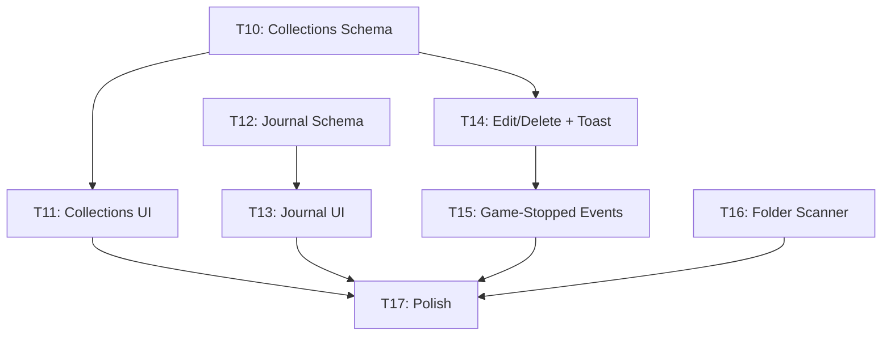

# Pirate Harbor — Phase 2 Implementation Plan

> **Product:** Pirate Harbor
> **Design System:** Atlas OS (see `Design/` folder — single source of truth)
> **Phase 1 Status:** ✅ Complete (Tasks 1–9, all reviewed and approved)
> **Commit convention:** `feat: T<N> - <Description>`

---

## Phase 2 Overview

Phase 2 brings Pirate Harbor from "functional MVP" to "rich personal archive." It adds:

1. **Collections** — curated galleries of games (the museum wing)
2. **Journal** — chronological play log with notes
3. **Game Editing & Deletion** — full lifecycle management via UI
4. **Watched Folder Scanner** — auto-detect installed games from disk
5. **Game-Stopped Event Integration** — real-time UI updates when games close
6. **UI Polish** — toast notifications, confirmation dialogs, loading skeletons

> [!IMPORTANT]
> **Milestones** (Phase 3) and **Identity** (Phase 4) remain deferred. They depend on data that only becomes meaningful once a user has significant play history.

---

## Design Authority

All UI work continues to reference the `Design/` folder as the single source of truth. Key specs for Phase 2:

| Document | Phase 2 usage |
|----------|---------------|
| `Pages/collections.md` | Collections page layout |
| `Pages/journal.md` | Journal page layout |
| `COMPONENTS.md` | Card, button, icon patterns for new pages |
| `interactions.md` | Hover/click behavior on new components |
| `MOTION.md` | Animation constraints for transitions |
| `accessibility.md` | All new interactive elements |

---

## Task Breakdown

---

### Task 10 — Collections: Schema & Rust Commands

**Objective:** Add the `collections` table and CRUD commands so users can organize games into curated groups.

#### Database

New migration `MIGRATION_002`:

```sql
CREATE TABLE IF NOT EXISTS collections (
    id          TEXT PRIMARY KEY,
    name        TEXT NOT NULL,
    description TEXT,
    cover_path  TEXT,
    cover_mode  TEXT NOT NULL DEFAULT 'auto',  -- 'auto' = 2x2 mosaic, 'custom' = user image
    created_at  TEXT NOT NULL,
    updated_at  TEXT NOT NULL
);

CREATE TABLE IF NOT EXISTS collection_games (
    collection_id TEXT NOT NULL REFERENCES collections(id) ON DELETE CASCADE,
    game_id       TEXT NOT NULL REFERENCES games(id) ON DELETE CASCADE,
    added_at      TEXT NOT NULL,
    sort_order    INTEGER NOT NULL DEFAULT 0,
    PRIMARY KEY (collection_id, game_id)
);

CREATE INDEX IF NOT EXISTS idx_collection_games_collection ON collection_games(collection_id);
CREATE INDEX IF NOT EXISTS idx_collection_games_game ON collection_games(game_id);
```

**Cover logic:**
- `cover_mode = 'auto'` (default): Frontend renders a 2×2 mosaic from the first 4 game covers in the collection. If fewer than 4 games, fills empty slots with `--color-elevated` placeholder.
- `cover_mode = 'custom'`: Uses `cover_path` as the collection cover image.
- User can switch between modes via the collection edit UI.

#### Rust

- [MODIFY] `src-tauri/src/db/migrations.rs` — Add `MIGRATION_002`, update `MIGRATIONS` array
- [MODIFY] `src-tauri/src/models.rs` — Add `Collection`, `NewCollection`, `UpdateCollection` structs. `Collection` includes `cover_mode: CoverMode` enum (`Auto` | `Custom`).
- [NEW] `src-tauri/src/commands/collections.rs` — Commands:
  - `create_collection(name, description?, cover_path?, cover_mode?)` → `Collection`
  - `get_all_collections()` → `Vec<Collection>` (with game count)
  - `get_collection(id)` → `Collection` (with games list)
  - `update_collection(id, updates)` → `Collection`
  - `delete_collection(id)` → `()`
  - `add_game_to_collection(collection_id, game_id)` → `()`
  - `remove_game_from_collection(collection_id, game_id)` → `()`
  - `get_collections_for_game(game_id)` → `Vec<Collection>` (which collections a game belongs to)
- [MODIFY] `src-tauri/src/commands/mod.rs` — Declare `collections` module
- [MODIFY] `src-tauri/src/lib.rs` — Register all collection commands

**Commit:** `feat: T10 - Collections schema and Rust commands`
**Verify:** `cargo check`, `cargo test`

---

### Task 11 — Collections: TypeScript & Page

**Objective:** Build the Collections page per `Design/Pages/collections.md`: "Curated galleries. Large covers. Editorial layouts. Museum-like presentation."

#### TypeScript Layer

- [MODIFY] `packages/shared/index.ts` — Add `Collection`, `NewCollection`, `UpdateCollection` types
- [MODIFY] `src/types/index.ts` — Mirror new types
- [MODIFY] `src/lib/api.ts` — Add typed invoke wrappers for all collection commands

#### Components

- [NEW] `src/components/CollectionCard.tsx` — Card for a collection:
  - `cover_mode = 'auto'`: renders 2×2 mosaic grid from first 4 game covers (with elevated-color fallback for empty slots)
  - `cover_mode = 'custom'`: renders `cover_path` as single image
  - Shows collection name and game count below
- [NEW] `src/components/CreateCollectionModal.tsx` — Modal/overlay to create a new collection (name, description, optional cover)
- [NEW] `src/components/AddToCollectionMenu.tsx` — Dropdown/popover to add a game to existing collections (shown from GameDetailPage)

#### Page

- [MODIFY] `src/pages/CollectionsPage.tsx` — Full implementation:
  - Editorial H1 title
  - Grid of `CollectionCard` components
  - Empty state: "No collections yet — create your first gallery"
  - Create button (opens modal)
- [NEW] `src/pages/CollectionDetailPage.tsx` — Single collection view:
  - Collection name as editorial title
  - Description below
  - Grid of games in the collection (reuses `GameCard`)
  - Remove game from collection (context action)
  - Edit/delete collection actions
- [MODIFY] `src/App.tsx` — Add route `/collections/:id` → `CollectionDetailPage`

#### Integration

- [MODIFY] `src/pages/GameDetailPage.tsx` — Add "Add to Collection" button/menu

**Commit:** `feat: T11 - Collections page and collection management`
**Verify:** Create collection → add games → view collection → remove game → delete collection. Full cycle.

---

### Task 12 — Journal: Schema & Rust Commands

**Objective:** Add journal entries — manual notes attached to sessions or standalone. The journal is the chronological memory of the archive.

#### Database

New migration `MIGRATION_003`:

```sql
CREATE TABLE IF NOT EXISTS journal_entries (
    id          TEXT PRIMARY KEY,
    game_id     TEXT REFERENCES games(id) ON DELETE CASCADE,
    session_id  TEXT REFERENCES sessions(id) ON DELETE SET NULL,
    content     TEXT NOT NULL,     -- No character limit. TEXT storage. Supports long-form writing.
    created_at  TEXT NOT NULL,
    updated_at  TEXT NOT NULL
);

CREATE INDEX IF NOT EXISTS idx_journal_game ON journal_entries(game_id);
CREATE INDEX IF NOT EXISTS idx_journal_created ON journal_entries(created_at);
```

Design choice: `game_id` is nullable — entries can be standalone reflections (not tied to a game). `session_id` is optional — when set, links the note to a specific play session.

#### Rust

- [MODIFY] `src-tauri/src/db/migrations.rs` — Add `MIGRATION_003`
- [MODIFY] `src-tauri/src/models.rs` — Add `JournalEntry`, `NewJournalEntry`, `UpdateJournalEntry`
- [NEW] `src-tauri/src/commands/journal.rs` — Commands:
  - `create_journal_entry(game_id?, session_id?, content)` → `JournalEntry`
  - `get_journal_entries(game_id?)` → `Vec<JournalEntry>` (all, or filtered by game)
  - `get_all_journal_entries(limit?, offset?)` → `Vec<JournalEntry>` (paginated, newest first)
  - `update_journal_entry(id, content)` → `JournalEntry`
  - `delete_journal_entry(id)` → `()`
- [MODIFY] `src-tauri/src/commands/mod.rs` — Declare `journal` module
- [MODIFY] `src-tauri/src/lib.rs` — Register journal commands

**Commit:** `feat: T12 - Journal schema and Rust commands`
**Verify:** `cargo check`, `cargo test`

---

### Task 13 — Journal: TypeScript & Page

**Objective:** Build the Journal page per `Design/Pages/journal.md`: "Chronological log of play sessions, notes, screenshots and milestones. Reading-first layout."

#### TypeScript Layer

- [MODIFY] `packages/shared/index.ts` — Add `JournalEntry`, `NewJournalEntry`, `UpdateJournalEntry`
- [MODIFY] `src/types/index.ts` — Mirror types
- [MODIFY] `src/lib/api.ts` — Add typed wrappers for journal commands

#### Components

- [NEW] `src/components/JournalEntryCard.tsx` — Single entry display (game title, content, timestamp, edit/delete actions)
- [NEW] `src/components/JournalComposer.tsx` — Textarea + game selector to write a new entry

#### Page

- [MODIFY] `src/pages/JournalPage.tsx` — Full implementation:
  - Editorial H1 title
  - Composer at top (write new entry)
  - Chronological feed of entries (newest first)
  - Entries grouped by date
  - Each entry shows: game title (if linked), content, relative timestamp
  - Edit inline, delete with confirmation
  - Empty state: "Your journal is empty — record your first thought"
  - Filter: "All" / per-game filter

#### Integration

- [MODIFY] `src/pages/GameDetailPage.tsx` — Add "Journal" section showing entries for this game + "Write a note" link

**Commit:** `feat: T13 - Journal page and entry management`
**Verify:** Create entry → view in journal → edit → delete. Per-game filtering works.

---

### Task 14 — Game Edit & Delete UI

**Objective:** Users can edit game metadata and delete games from the library — completing the CRUD loop in the UI.

> [!NOTE]
> The Rust commands `update_game` and `delete_game` already exist (T4). This task only builds the frontend UI.

#### Components

- [NEW] `src/components/ConfirmDialog.tsx` — Reusable confirmation dialog (title, message, confirm/cancel actions). Monochrome, flat, per `COMPONENTS.md`.
- [NEW] `src/components/Toast.tsx` — Minimal toast notification component (auto-dismiss, bottom-right). For success/error feedback.
- [NEW] `src/stores/useToastStore.ts` — Zustand store for toast queue

#### Page Modifications

- [MODIFY] `src/pages/GameDetailPage.tsx` — Add:
  - "Edit" button → navigates to edit page
  - "Delete" button → opens `ConfirmDialog` → calls `deleteGame` → redirects to library
  - Toast on success/error
- [NEW] `src/pages/EditGamePage.tsx` — Pre-filled form (reuses AddGamePage's Field pattern):
  - All game fields editable
  - Save → calls `updateGame` → navigates back to detail
  - Cancel → navigates back
- [MODIFY] `src/App.tsx` — Add route `/library/:id/edit` → `EditGamePage`

**Commit:** `feat: T14 - Game edit/delete UI, toast notifications, confirm dialogs`
**Verify:** Edit title → saves → detail reflects change. Delete game → confirm → redirected to library. Toast appears.

---

### Task 15 — Game-Stopped Event Integration

**Objective:** When the background monitor detects a game has exited, the frontend should react in real-time — refresh data and show feedback.

> [!NOTE]
> The Rust side already emits a `game-stopped` event (T6 launcher.rs). This task wires the frontend listener.

#### Implementation

- [NEW] `src/hooks/useGameStoppedListener.ts` — Custom hook:
  - Uses `@tauri-apps/api/event` to listen for `game-stopped`
  - On event: re-fetches game data, shows toast ("Game session ended — X minutes recorded")
  - Cleans up listener on unmount
- [MODIFY] `src/layouts/AppLayout.tsx` — Mount `useGameStoppedListener` at the layout level (always active)
- [MODIFY] `src/pages/GameDetailPage.tsx` — Re-fetch game + sessions when `game-stopped` fires for the current game
- [MODIFY] `src/pages/LauncherPage.tsx` — Re-fetch hero + recent when any game stops

**Commit:** `feat: T15 - Game-stopped event listener and real-time UI updates`
**Verify:** Launch game → close game → toast appears → GameDetail stats refresh → LauncherPage hero updates.

---

### Task 16 — Watched Folder Scanner

**Objective:** Auto-detect games from user-specified directories with confidence scoring. Filters out system/launcher executables and small files.

#### Rust

- [MODIFY] `Cargo.toml` — Add `walkdir` crate
- [NEW] `src-tauri/src/commands/scanner.rs` — Commands:
  - `scan_directory(path)` → `Vec<DiscoveredGame>` — Walks the directory tree and scores each `.exe`:
    - **Confidence scoring (0.0–1.0):**
      - +0.3 if exe is in a named subfolder (not root)
      - +0.2 if folder contains typical game files (.dll, .pak, .uasset, data/ folder)
      - +0.2 if exe name matches folder name (main executable heuristic)
      - +0.2 if exe is in a well-known game directory pattern (e.g. `bin/`, `Binaries/`)
      - +0.1 if exe size > 50MB (larger = more likely a game)
    - **Ignore list (common launchers/system executables):**
      - `UnityCrashHandler*.exe`, `UE4PrereqSetup*.exe`, `CrashReportClient.exe`
      - `unins*.exe`, `setup.exe`, `installer.exe`, `update*.exe`, `redist*.exe`
      - `dxsetup.exe`, `vcredist*.exe`, `dotnet*.exe`
      - `steam.exe`, `EpicGamesLauncher.exe`, `GalaxyClient.exe`
    - **Size filter:** Skip `.exe` files under 20MB
    - Returns: `{ exe_path, title (inferred), confidence, folder_name, size_mb }`
  - `batch_add_games(games: Vec<NewGame>)` → `Vec<Game>` (bulk insert, skipping duplicates by exe_path)
- [MODIFY] `src-tauri/src/models.rs` — Add `DiscoveredGame` struct with `confidence: f64` field
- [MODIFY] `src-tauri/src/commands/mod.rs` — Declare `scanner` module
- [MODIFY] `src-tauri/src/lib.rs` — Register scanner commands

#### Frontend

- [MODIFY] `src/lib/api.ts` — Add `scanDirectory`, `batchAddGames` wrappers
- [MODIFY] `src/types/index.ts` — Add `DiscoveredGame` type (with `confidence` number)
- [NEW] `src/pages/ScanPage.tsx` — Scanner workflow:
  1. "Choose folder" button (uses FilePickerButton with `directory: true`)
  2. Displays discovered games sorted by confidence (highest first)
  3. Each row shows: inferred title, exe path, size, **confidence bar** (visual 0–100%)
  4. High confidence (≥0.7): pre-selected. Low confidence (<0.4): deselected by default.
  5. Select/deselect individual games or "Select All High Confidence"
  6. "Add Selected" button → bulk inserts → navigates to library with toast
  7. Shows summary: "Found X potential games in [folder]"
  8. Skip games already in library (match by exe_path — shown as "Already added" disabled row)
- [MODIFY] `src/App.tsx` — Add route `/library/scan` → `ScanPage`
- [MODIFY] `src/pages/LibraryPage.tsx` — Add "Scan Folder" button next to "Add Game"
- [MODIFY] `src/pages/SettingsPage.tsx` — Add "Scan Folders" section (shortcut to /library/scan)

**Commit:** `feat: T16 - Watched folder scanner with confidence scoring`
**Verify:** Point at a folder → discovers .exe files → system exes filtered → confidence displayed → select high-confidence → add → appear in library.

---

### Task 17 — Phase 2 Polish & Integration Testing

**Objective:** Final polish pass. Ensure all new features integrate cleanly with Phase 1 work.

#### Checklist

- [ ] All new pages use `atlas-enter` animation
- [ ] All new interactive elements have `aria-label`
- [ ] All new buttons/links are keyboard-accessible (`tabIndex`, `onKeyDown`)
- [ ] Focus rings work on all new components
- [ ] `prefers-reduced-motion` disables all new animations
- [ ] Loading states on all new pages
- [ ] Error states with user-friendly messages
- [ ] No TypeScript errors (`pnpm tsc --noEmit`)
- [ ] No Rust warnings (`cargo check`)
- [ ] Sidebar active state works for new routes (`/collections`, `/collections/:id`, `/journal`)
- [ ] All new features work with empty database
- [ ] Toast notifications don't overlap or persist incorrectly
- [ ] ConfirmDialog is keyboard-dismissable (Escape key)
- [ ] Collections survive game deletion (CASCADE removes junction records)
- [ ] Journal entries survive game deletion (CASCADE)

**Commit:** `feat: T17 - Phase 2 polish and integration`
**Verify:** Full acceptance test (see below)

---

## Dependency Graph



**Critical path:** T10 → T11 → T17
**Parallel tracks:** T10/T11 (Collections) ‖ T12/T13 (Journal) — can be worked independently

---

## Resolved Decisions

| Decision | Answer |
|----------|--------|
| Collection covers | Auto-generated 2×2 mosaic by default, user-selected `cover_path` as optional override. `cover_mode` column tracks which mode. |
| Journal entry length | No hard limit. `TEXT` storage. Supports long-form writing. |
| Scanner filtering | Confidence scoring (0.0–1.0), ignore common launchers/system exes, ignore files < 20MB. Confidence surfaced in UI. |

---

## Phase 2 Acceptance Test

1. Create a collection "Favorites 2024" with a description
2. Collection card shows 2×2 mosaic cover (auto mode)
3. Add 3 games to the collection → mosaic updates
4. Override with custom cover → `cover_mode` switches to `custom`
5. Remove 1 game from collection → 2 remain
6. Write a journal entry linked to a game (long-form, multi-paragraph)
7. Write a standalone journal entry (no game)
8. View journal → entries appear chronologically, full content rendered
9. Edit a journal entry → content updates
10. Edit a game's title → GameDetail reflects change
11. Delete a game → confirm dialog → removed from library + collections + journal
12. Toast appears on all CRUD operations
13. Launch game → close game → toast "session ended" → stats refresh
14. Scan a folder → system exes filtered → confidence scores displayed → pre-selects high confidence
15. Add scanned games → appear in library, duplicates skipped
16. All pages keyboard-navigable
17. All new components respect `prefers-reduced-motion`

---

## Future Backlog (Phase 3+)

| Feature | Description | Phase |
|---------|-------------|-------|
| Milestones page | Display achievements as archival records (progress, rare milestones, unlock timeline, statistics) | Phase 3 |
| Identity page | Profile, favorite genres, runtime stats, recent journeys, completion timeline | Phase 4 |
| Metadata Enrichment Engine | Auto-fetch game metadata from RAWG/IGDB APIs with local cache and manual fallback | Phase 3 |
| Cover/Background Acquisition | Auto-download cover art and background images from metadata APIs | Phase 3 |
| Genre & Developer Metadata | Auto-populate genre, developer, publisher fields from external APIs | Phase 3 |
