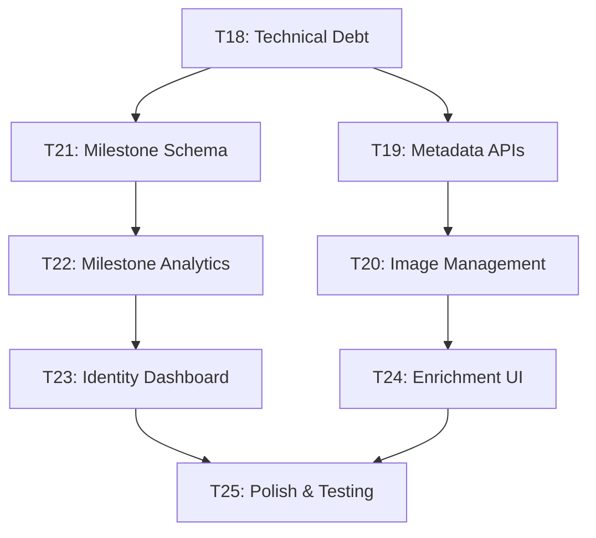

# Pirate Harbor — Phase 3 Implementation Plan

> **Product:** Pirate Harbor
> **Design System:** Atlas OS (see `Design/` folder — single source of truth)
> **Phase 1 Status:** ✅ Complete (Tasks 1–9, all reviewed and approved)
> **Phase 2 Status:** ✅ Complete (Tasks 10–17, all reviewed and approved)
> **Commit convention:** `feat: T<N> - <Description>`

---

## Phase 3 Overview

Phase 3 transforms Pirate Harbor from a "rich personal archive" to an "intelligent gaming companion." It adds:

1. **Metadata Enrichment Engine** — Auto-fetch game metadata from RAWG/IGDB APIs with local caching
2. **Enhanced Milestone System** — Formal database structure for achievement tracking with statistics
3. **Identity Dashboard** — Complete personal gaming profile with insights and analytics
4. **Technical Debt Resolution** — Address M1/M2 issues from Phase 2 review
5. **API Integration Layer** — Robust external service integration with fallbacks and rate limiting
6. **Gaming Statistics Engine** — Deep analytics for gaming patterns and behavioral insights

> [!IMPORTANT]
> **Phase 3 builds on existing foundations.** The Milestones page already exists and is functional. Identity page exists as placeholder. This phase enhances and completes these features while adding intelligence through metadata automation.

---

## Design Authority

All UI work continues to reference the `Design/` folder as the single source of truth. Key specs for Phase 3:

| Document | Phase 3 usage |
|----------|---------------|
| `Pages/milestones.md` | Enhanced milestone display with statistics |
| `Pages/identity.md` | Complete identity dashboard implementation |
| `COMPONENTS.md` | New data visualization components, progress indicators |
| `interactions.md` | Loading states, progress feedback for async operations |
| `MOTION.md` | Animation constraints for data loading transitions |
| `accessibility.md` | All new interactive elements and data visualizations |

---

## Architecture Decisions

| Decision | Answer | Rationale |
|----------|--------|-----------|
| Metadata API Priority | RAWG primary, IGDB fallback | RAWG has better free tier, IGDB as backup |
| Image Storage | Local filesystem with metadata DB refs | Performance + offline capability |
| Cache Strategy | SQLite table with TTL | Consistent with existing DB architecture |
| Milestone Migration | Extend journal_entries, add milestones table | Preserve existing data + add structure |
| API Rate Limiting | Exponential backoff with queue | Respectful API usage |
| Background Processing | Tauri async tasks with progress events | Non-blocking UI experience |

---

## Task Breakdown

---

### Task 18 — Technical Debt Resolution (Phase 2 M1/M2)

**Objective:** Address the outstanding moderate issues from Phase 2 review before adding new complexity.

#### M1 Fix: Transaction Wrapping for batch_add_games

- [MODIFY] `src-tauri/src/commands/scanner.rs` — Wrap `batch_add_games` in SQLite transaction:
  ```rust
  let mut transaction = conn.transaction()?;
  // Perform all inserts within transaction
  transaction.commit()?;
  ```
- Performance improvement for large game batches (50+ games)

#### M2 Fix: Complete cover_mode Implementation 

- [MODIFY] `src-tauri/src/db/migrations.rs` — Add `MIGRATION_004` with proper `cover_mode` and `cover_path` columns
- [MODIFY] `src-tauri/src/models.rs` — Update `Collection` struct with `cover_mode: CoverMode` enum
- [MODIFY] `src-tauri/src/commands/collections.rs` — Update queries for new columns
- [MODIFY] `src/types/index.ts` — Add `cover_mode: 'auto' | 'custom'` and `cover_path: string | null`
- [MODIFY] `src/pages/CollectionsPage.tsx` — Implement auto mosaic vs custom image rendering

**Commit:** `feat: T18 - Phase 2 technical debt resolution (M1, M2)`
**Verify:** `cargo check`, collections work with both cover modes, batch operations use transactions.

---

### Task 19 — Metadata API Integration Layer

**Objective:** Build the core metadata fetching infrastructure with RAWG and IGDB integration.

#### Database Schema

New migration `MIGRATION_005`:

```sql
CREATE TABLE IF NOT EXISTS metadata_cache (
    id          TEXT PRIMARY KEY,
    game_title  TEXT NOT NULL,
    provider    TEXT NOT NULL,           -- 'rawg' or 'igdb'
    api_id      INTEGER,                 -- External API game ID
    metadata    TEXT NOT NULL,           -- JSON blob of fetched data
    cached_at   TEXT NOT NULL,
    expires_at  TEXT NOT NULL
);

CREATE TABLE IF NOT EXISTS metadata_enrichment_queue (
    id          TEXT PRIMARY KEY,
    game_id     TEXT NOT NULL REFERENCES games(id) ON DELETE CASCADE,
    priority    INTEGER NOT NULL DEFAULT 0,  -- 0=low, 1=normal, 2=high
    status      TEXT NOT NULL DEFAULT 'pending',  -- pending, processing, completed, failed
    created_at  TEXT NOT NULL,
    updated_at  TEXT NOT NULL
);

CREATE INDEX IF NOT EXISTS idx_metadata_cache_title ON metadata_cache(game_title);
CREATE INDEX IF NOT EXISTS idx_enrichment_queue_status ON metadata_enrichment_queue(status);
```

#### Rust Implementation

- [MODIFY] `Cargo.toml` — Add `reqwest`, `serde_json`, `tokio-util`
- [NEW] `src-tauri/src/api/mod.rs` — API client infrastructure
- [NEW] `src-tauri/src/api/rawg.rs` — RAWG API client with rate limiting
- [NEW] `src-tauri/src/api/igdb.rs` — IGDB API client (fallback)
- [NEW] `src-tauri/src/commands/metadata.rs` — Commands:
  - `enrich_game_metadata(game_id)` → `EnrichmentResult`
  - `bulk_enrich_library()` → `()` (background task)
  - `get_enrichment_status()` → `EnrichmentStatus`
  - `search_game_metadata(title)` → `Vec<MetadataSearchResult>`
- [MODIFY] `src-tauri/src/models.rs` — Add metadata-related structs

#### Rate Limiting & Background Processing

- Implement exponential backoff: 1s, 2s, 4s, 8s, 16s max delay
- Queue-based processing: max 10 requests per minute per API
- Progress events: emit `metadata-enrichment-progress` to frontend
- Graceful degradation: continue with manual entry if APIs fail

**Commit:** `feat: T19 - Metadata API integration layer with RAWG/IGDB`
**Verify:** `cargo check`, manual test with game title search, rate limiting works.

---

### Task 20 — Image Download & Management System

**Objective:** Automatically download and manage cover art and background images from metadata APIs.

#### Image Storage Strategy

- **Storage location:** `%APPDATA%/com.pirate-harbor.app/images/`
- **Directory structure:**
  ```
  images/
  ├── covers/       # 512x512 game covers
  ├── backgrounds/  # 1920x1080 ambient backgrounds  
  └── thumbnails/   # 256x256 quick previews
  ```
- **Naming convention:** `{game_id}_{type}.{ext}` (e.g., `abc123_cover.jpg`)

#### Rust Implementation

- [MODIFY] `Cargo.toml` — Add `image`, `tokio-fs`
- [NEW] `src-tauri/src/images/mod.rs` — Image processing utilities
- [NEW] `src-tauri/src/images/downloader.rs` — Async image downloader with retry logic
- [NEW] `src-tauri/src/images/processor.rs` — Resize/convert images to target specs
- [MODIFY] `src-tauri/src/commands/metadata.rs` — Add image downloading to enrichment:
  - `download_game_images(game_id, metadata)` → `ImageDownloadResult`
  - Resize covers to 512x512, backgrounds to 1920x1080
  - Support JPG, PNG, WebP input; convert to optimal format
  - Emit `image-download-progress` events

#### Database Updates

- [MODIFY migration 005] — Add image tracking:
  ```sql
  ALTER TABLE games ADD COLUMN cover_path_local TEXT;
  ALTER TABLE games ADD COLUMN background_path_local TEXT;
  ALTER TABLE games ADD COLUMN images_enriched_at TEXT;
  ```

#### Frontend Integration

- [MODIFY] `src/lib/api.ts` — Add image download commands
- [MODIFY] `src/components/GameCard.tsx` — Prefer local images over remote URLs
- [MODIFY] `src/components/AmbientLayer.tsx` — Use local background images when available
- Progress indicators during bulk image download operations

**Commit:** `feat: T20 - Image download and management system`
**Verify:** Images download correctly, resize to target dimensions, GameCard shows local images.

---

### Task 21 — Enhanced Milestone Database Schema

**Objective:** Create formal milestone structure while preserving existing journal-based milestones.

#### Database Schema

New migration `MIGRATION_006`:

```sql
CREATE TABLE IF NOT EXISTS milestones (
    id              TEXT PRIMARY KEY,
    game_id         TEXT NOT NULL REFERENCES games(id) ON DELETE CASCADE,
    title           TEXT NOT NULL,
    description     TEXT,
    category        TEXT NOT NULL,        -- 'completion', 'progress', 'exploration', 'mastery', 'social', 'custom'
    difficulty      TEXT,                 -- 'trivial', 'easy', 'normal', 'hard', 'legendary'
    achievement_date TEXT NOT NULL,
    points          INTEGER DEFAULT 0,    -- Optional scoring system
    metadata        TEXT,                 -- JSON for extensibility
    created_at      TEXT NOT NULL,
    updated_at      TEXT NOT NULL
);

CREATE TABLE IF NOT EXISTS milestone_templates (
    id          TEXT PRIMARY KEY,
    title       TEXT NOT NULL,
    description TEXT,
    category    TEXT NOT NULL,
    difficulty  TEXT,
    is_global   BOOLEAN NOT NULL DEFAULT 0,  -- 0=game-specific, 1=universal template
    created_at  TEXT NOT NULL
);

-- Link existing journal entries to new milestones (migration helper)
CREATE INDEX IF NOT EXISTS idx_milestones_game ON milestones(game_id);
CREATE INDEX IF NOT EXISTS idx_milestones_category ON milestones(category);
CREATE INDEX IF NOT EXISTS idx_milestones_date ON milestones(achievement_date);
```

#### Migration Logic

- Preserve all existing `journal_entries` with `entry_type = 'milestone'`
- Create corresponding `milestones` table entries for journal milestones
- Link via new `journal_entry_id` column for backward compatibility
- Default category: infer from content or mark as 'custom'

#### Rust Implementation

- [MODIFY] `src-tauri/src/models.rs` — Add `Milestone`, `NewMilestone`, `MilestoneTemplate`
- [NEW] `src-tauri/src/commands/milestones.rs` — Commands:
  - `create_milestone(game_id, title, description, category, difficulty)` → `Milestone`
  - `get_milestones(game_id?, category?, limit?)` → `Vec<Milestone>`
  - `get_milestone_statistics(game_id?)` → `MilestoneStatistics`
  - `create_milestone_from_template(template_id, game_id)` → `Milestone`
  - `get_milestone_templates(category?)` → `Vec<MilestoneTemplate>`
  - `delete_milestone(id)` → `()`

#### Default Templates

Seed common milestone templates:
- **Completion:** "First Completion", "100% Completion", "Perfect Score"
- **Progress:** "Reached Halfway Point", "Unlocked All Areas", "Max Level"
- **Exploration:** "Found Secret Area", "Discovered All Collectibles"
- **Mastery:** "Speedrun Personal Best", "No Death Run", "Hardest Difficulty"
- **Social:** "Played with Friends", "Community Achievement"

**Commit:** `feat: T21 - Enhanced milestone database schema with templates`
**Verify:** `cargo check`, milestone CRUD works, templates seed correctly.

---

### Task 22 — Milestone Statistics & Analytics Engine

**Objective:** Build comprehensive statistics and trend analysis for milestone data.

#### Statistics Calculations

- [NEW] `src-tauri/src/analytics/mod.rs` — Analytics engine
- [NEW] `src-tauri/src/analytics/milestones.rs` — Milestone-specific analytics:
  ```rust
  pub struct MilestoneStatistics {
      pub total_count: i64,
      pub by_category: HashMap<String, i64>,
      pub by_difficulty: HashMap<String, i64>,
      pub recent_streak_days: i64,
      pub completion_rate: f64,
      pub average_per_week: f64,
      pub top_games: Vec<GameMilestoneCount>,
      pub timeline: Vec<MilestoneTimelineEntry>,
  }
  ```

#### Advanced Analytics

- **Completion trends:** Milestone frequency over time (daily, weekly, monthly)
- **Category distribution:** Which types of milestones user prefers
- **Difficulty analysis:** User's challenge-seeking behavior
- **Game comparison:** Which games generate most milestones
- **Streak tracking:** Consecutive days with milestone activity
- **Seasonal patterns:** Gaming behavior across different time periods

#### Frontend Integration

- [MODIFY] `src/pages/MilestonesPage.tsx` — Enhance existing page with analytics:
  - Add statistics dashboard in sidebar (already exists, enhance with new data)
  - Add trending/insights section
  - Category filtering with statistics
  - Timeline visualization improvements
  - Completion rate tracking per game

#### Performance Optimization

- Cache statistics calculations (refresh on milestone changes)
- Paginate large milestone lists
- Async loading for heavy analytics queries

**Commit:** `feat: T22 - Milestone statistics and analytics engine`
**Verify:** Statistics calculate correctly, MilestonesPage shows rich analytics, performance is acceptable.

---

### Task 23 — Identity Dashboard Implementation

**Objective:** Complete the Identity page implementation per `Design/Pages/identity.md`: "Profile Favorite genres Runtime Recent journeys Completion Timeline"

#### Database Analytics Queries

- [NEW] `src-tauri/src/analytics/identity.rs` — Identity-specific analytics:
  ```rust
  pub struct GamingIdentity {
      pub profile_summary: ProfileSummary,
      pub favorite_genres: Vec<GenrePreference>,
      pub runtime_statistics: RuntimeStats,
      pub recent_journeys: Vec<RecentJourney>,
      pub completion_timeline: Vec<CompletionEvent>,
      pub gaming_personality: GamingPersonality,
  }
  ```

#### Analytics Calculations

- **Genre preferences:** Based on playtime, milestone count, and session frequency
- **Session patterns:** Preferred session lengths, gaming times, frequency
- **Completion behavior:** Completion rate trends, abandonment patterns
- **Gaming personality:** Categorize as Explorer, Achiever, Completionist, Casual, etc.
- **Recent activity:** Last 30 days of significant gaming events
- **Personal records:** Longest session, most productive week, completion streaks

#### Identity Dashboard Layout

- [MODIFY] `src/pages/IdentityPage.tsx` — Full implementation replacing placeholder:
  - **Profile header:** Total stats, gaming since date, personality type
  - **Favorite genres:** Visual breakdown with playtime percentages
  - **Runtime statistics:** Total time, average session, trends over time
  - **Recent journeys:** Last played games with progression indicators
  - **Completion timeline:** Major milestones and completions chronologically
  - **Gaming insights:** Behavioral patterns and recommendations

#### Data Visualization Components

- [NEW] `src/components/GenreChart.tsx` — Genre preference visualization
- [NEW] `src/components/PlaytimeChart.tsx` — Runtime trends over time
- [NEW] `src/components/CompletionTimeline.tsx` — Major achievements timeline
- [NEW] `src/components/GamingPersonalityCard.tsx` — Personality type display

#### Privacy & Export Features

- Privacy toggles for sensitive statistics
- Export gaming profile as JSON/PDF
- Anonymization options for sharing

**Commit:** `feat: T23 - Complete Identity dashboard implementation`
**Verify:** Identity page shows comprehensive gaming profile, visualizations work, privacy controls function.

---

### Task 24 — Metadata Enrichment UI Integration

**Objective:** Integrate metadata enrichment into existing UI workflows with progress feedback and manual fallbacks.

#### Library Page Integration

- [MODIFY] `src/pages/LibraryPage.tsx` — Add enrichment controls:
  - "Enrich Library" button in toolbar
  - Progress indicator during bulk enrichment
  - Show enrichment status per game (enriched/pending/failed)
  - Bulk retry failed enrichments

#### Game Detail Integration

- [MODIFY] `src/pages/GameDetailPage.tsx` — Add per-game enrichment:
  - "Fetch Metadata" button when game lacks metadata
  - Show enrichment status and last updated
  - Manual metadata editor for failed enrichments
  - Preview metadata before applying

#### Add Game Workflow Enhancement

- [MODIFY] `src/pages/AddGamePage.tsx` — Auto-enrichment during add:
  - Search for metadata as user types game title
  - Show metadata preview with option to accept/reject
  - Fallback to manual entry if no matches
  - Save time by pre-filling detected fields

#### Settings Integration

- [MODIFY] `src/pages/SettingsPage.tsx` — Add metadata preferences:
  - Enable/disable auto-enrichment
  - API provider priority (RAWG vs IGDB)
  - Image download preferences
  - Cache management (clear cache, cache size)

#### Background Processing UI

- [NEW] `src/components/EnrichmentProgressBar.tsx` — Global progress indicator
- [NEW] `src/hooks/useEnrichmentProgress.ts` — Listen for enrichment events
- Toast notifications for enrichment completion/failures
- Ability to pause/resume bulk operations

**Commit:** `feat: T24 - Metadata enrichment UI integration with progress feedback`
**Verify:** Enrichment works from Library, GameDetail, AddGame pages. Progress feedback is clear. Manual fallbacks work.

---

### Task 25 — Phase 3 Polish & Integration Testing

**Objective:** Final polish pass ensuring all Phase 3 features integrate seamlessly with existing Phase 1/2 functionality.

#### Database Migration Testing

- Test all migrations run cleanly on existing Phase 2 databases
- Verify data preservation during milestone migration
- Test rollback capability for emergency recovery
- Performance testing with large datasets (1000+ games, 10000+ sessions)

#### Integration Checklist

- [ ] All new pages follow Atlas OS design consistency
- [ ] Metadata enrichment respects API rate limits
- [ ] Image downloads don't block UI operations
- [ ] Milestone statistics update in real-time
- [ ] Identity dashboard calculations are performant
- [ ] All new features work with empty databases
- [ ] Accessibility: keyboard navigation, screen reader support
- [ ] Error handling: network failures, API errors, disk space issues
- [ ] Memory usage: large image operations don't cause OOM
- [ ] Background tasks: proper cleanup on app shutdown

#### Performance Optimization

- Lazy loading for heavy Identity dashboard analytics
- Image thumbnail generation for faster UI rendering
- Database query optimization for milestone statistics
- Proper async/await patterns for all API calls

#### Error Recovery

- Graceful degradation when APIs are unavailable
- Retry mechanisms for failed operations
- User-friendly error messages with actionable steps
- Log rotation and error reporting

**Commit:** `feat: T25 - Phase 3 polish and integration testing`
**Verify:** Full Phase 3 acceptance test (see below).

---

## Dependency Graph



**Critical path:** T18 → T19 → T20 → T24 → T25
**Parallel tracks:** T21 → T22 → T23 can be developed alongside metadata work

---

## Phase 3 Acceptance Test

1. **Technical Debt Resolution**
   - Create collection → verify auto/custom cover modes work
   - Bulk add 50+ games → verify transaction wrapping improves performance

2. **Metadata Enrichment**
   - Add new game → auto-enrichment fetches metadata and images
   - Bulk enrich library → progress indicator shows status
   - API failure → graceful fallback to manual entry

3. **Enhanced Milestones**
   - Create milestone from template → saves with proper categorization
   - View milestone statistics → calculations are accurate and fast
   - Existing journal milestones → properly migrated and linked

4. **Identity Dashboard**
   - View Identity page → comprehensive gaming profile displays
   - Genre preferences → accurate based on playtime data
   - Completion timeline → shows major achievements chronologically
   - Export profile → JSON export works correctly

5. **Integration & Performance**
   - All pages load within 2 seconds with 1000+ games
   - Background operations don't block UI interactions
   - Memory usage remains stable during bulk operations
   - Database integrity maintained through all migrations

6. **Error Handling**
   - Network disconnection → operations degrade gracefully
   - API rate limit → requests queue properly with backoff
   - Disk full → clear error message with recovery options

---

## Future Considerations (Phase 4+)

| Feature | Description | Priority |
|---------|-------------|----------|
| Cloud Backup | Sync library and progress across devices | High |
| Social Features | Share profiles, compare achievements with friends | Medium |
| Recommendation Engine | Suggest games based on playing patterns | Medium |
| Advanced Analytics | Machine learning insights, pattern recognition | Low |
| Plugin System | Third-party integrations and custom metadata sources | Low |

---

## Resolved Decisions

| Decision | Answer |
|----------|--------|
| Milestone migration strategy | Extend journal system, create formal table, maintain backward compatibility |
| Image storage approach | Local filesystem with database references for performance and offline capability |
| API rate limiting | Exponential backoff with queuing, respect provider limits |
| Statistics caching | In-memory cache with invalidation on data changes |
| Identity privacy | User-controlled visibility settings with export/anonymization options |
| Background processing | Tauri async tasks with event-based progress reporting |
