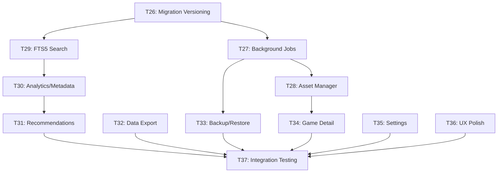

# Pirate Harbor — Phase 4 Implementation Plan (Revised)

> **Phases 1–3:** ✅ Complete | **Design System:** Atlas OS | **Commit:** `feat: T<N> - <desc>`

## Amendments Applied

| # | Amendment | Status |
|---|-----------|--------|
| 1 | Cloud Backup → Phase 5 | ✅ |
| 2 | Backup intervals: Never/Daily/Weekly/Monthly | ✅ |
| 3 | Gallery limit: default 50, soft 100, no hard cap | ✅ |
| 4 | Centralized Asset Management System | ✅ New T28 |
| 5 | Background Job Scheduler | ✅ New T27 |
| 6 | Recommendation Strategy pattern | ✅ Restructured T31 |
| 7 | SQLite FTS5 search index | ✅ New T29 |
| 8 | Shared Analytics & Metadata engines | ✅ New T30 |

---

## Task Overview (T26–T37)

### Infrastructure Layer (do first)

| Task | Description | Est. |
|------|-------------|------|
| **T26** | Migration versioning system | 0.5d |
| **T27** | Background job scheduler | 1.5d |
| **T28** | Asset management system | 1.5d |
| **T29** | SQLite FTS5 search index | 1d |

### Service Layer (shared engines)

| Task | Description | Est. |
|------|-------------|------|
| **T30** | Analytics & Metadata engines | 2d |
| **T31** | Recommendation engine (strategy pattern) | 1.5d |

### Feature Layer

| Task | Description | Est. |
|------|-------------|------|
| **T32** | Data export (JSON + Markdown) | 1.5d |
| **T33** | Local backup & restore | 2d |
| **T34** | Game Detail enrichment (Gallery, Notes, Related) | 1.5d |
| **T35** | Settings page completion | 1d |

### Polish Layer

| Task | Description | Est. |
|------|-------------|------|
| **T36** | UX polish (a11y, keyboard, skeletons) | 1.5d |
| **T37** | Integration testing & acceptance | 1d |

**Total: ~16.5 days**

---

## Dependency Graph



---

## Task Details

---

### T26 — Migration Versioning System

**Objective:** Replace "run all migrations every time" with version-tracked upgrades.

**Files:**
- [MODIFY] `src-tauri/src/db/migrations.rs`
  - Add `get_schema_version(conn) -> i32` — reads from `settings` table (default 0)
  - Add `set_schema_version(conn, v)` — writes to `settings` table
  - `run_migrations()` skips migrations at or below current version
  - Existing databases auto-detect as version 6

**Verify:** `cargo test db::migrations` — fresh DB = v6, existing DB skips re-runs.

---

### T27 — Background Job Scheduler

**Objective:** Non-blocking execution for scans, backups, metadata, recommendations, integrity checks.

**Module:** `src-tauri/src/background/`

```
background/
├── mod.rs          // Public API
├── job.rs          // Job trait + JobStatus enum
├── queue.rs        // Priority queue (VecDeque-based)
├── scheduler.rs    // Cron-like scheduling (startup, interval)
└── worker.rs       // Tokio task runner with progress events
```

**Key design:**
```rust
pub trait Job: Send + Sync {
    fn name(&self) -> &str;
    fn execute(&self, ctx: JobContext) -> Result<JobResult, String>;
}

pub struct JobContext {
    pub conn: Arc<Mutex<Connection>>,
    pub app_handle: tauri::AppHandle,  // For emitting progress events
}

pub enum JobStatus { Queued, Running(f32), Done, Failed(String) }
```

**Tauri commands:**
- `get_job_status(job_id)` → `JobStatus`
- `cancel_job(job_id)` → `bool`
- `list_active_jobs()` → `Vec<JobInfo>`

**Frontend:**
- [NEW] `src/hooks/useJobProgress.ts` — Listens to Tauri events for job progress
- [MODIFY] `src/components/TopBar.tsx` — Show active job indicator (subtle spinner)

**Verify:** Queue a test job, verify it runs async, progress events reach frontend.

---

### T28 — Asset Management System

**Objective:** Centralized image pipeline for all asset types (covers, backgrounds, gallery, future icons/logos).

**Module:** `src-tauri/src/assets/`

```
assets/
├── mod.rs              // Public API: store, retrieve, delete, stats
├── asset_manager.rs    // Core orchestrator
├── cover_cache.rs      // Cover-specific logic (resize to standard dims)
├── background_cache.rs // Background-specific (larger, blur-ready)
├── thumbnail_gen.rs    // Generate thumbnails for gallery/covers
└── dedup.rs            // SHA-256 hash-based duplicate detection
```

**Storage layout** (in `app_data_dir()`):
```
pirate_harbor/
├── assets/
│   ├── covers/       {game_id}.webp
│   ├── backgrounds/  {game_id}.webp
│   ├── gallery/      {game_id}/{uuid}.webp
│   └── thumbnails/   {hash}_thumb.webp
```

**Key API:**
```rust
pub struct AssetManager { base_dir: PathBuf }

impl AssetManager {
    pub fn store_cover(&self, game_id: &str, source: &Path) -> Result<AssetRef>
    pub fn store_gallery_image(&self, game_id: &str, source: &Path) -> Result<AssetRef>
    pub fn get_gallery_images(&self, game_id: &str) -> Result<Vec<AssetRef>>
    pub fn delete_asset(&self, asset_ref: &AssetRef) -> Result<()>
    pub fn get_storage_stats(&self) -> Result<StorageStats>
    pub fn cleanup_orphans(&self, conn: &Connection) -> Result<CleanupResult>
    pub fn deduplicate(&self, source: &Path) -> Result<Option<AssetRef>> // Returns existing if duplicate
}
```

**Tauri state:** `AssetManager` managed as Tauri state, injected into commands that need images.

**Verify:** Store/retrieve/delete covers. Duplicate detection works. Stats are accurate.

---

### T29 — SQLite FTS5 Search Index

**Objective:** Full-text search across games, journal entries, and milestones for large libraries (1000+ games).

**Migration 007:**
```sql
CREATE VIRTUAL TABLE IF NOT EXISTS games_fts USING fts5(
    title, developer, publisher, genre,
    content='games', content_rowid='rowid'
);

CREATE VIRTUAL TABLE IF NOT EXISTS journal_fts USING fts5(
    title, body,
    content='journal_entries', content_rowid='rowid'
);

-- Triggers to keep FTS in sync
CREATE TRIGGER IF NOT EXISTS games_ai AFTER INSERT ON games BEGIN
    INSERT INTO games_fts(rowid, title, developer, publisher, genre)
    VALUES (new.rowid, new.title, new.developer, new.publisher, new.genre);
END;
-- + UPDATE and DELETE triggers for both tables
```

**Commands:**
- `search_global(query, limit)` → `SearchResults { games, journal_entries, milestones }`
- `rebuild_search_index()` → Background job to rebuild FTS tables

**Frontend:**
- [MODIFY] `src/components/TopBar.tsx` — Global search input (Cmd+K shortcut)
- [NEW] `src/components/SearchOverlay.tsx` — Modal with categorized results

**Verify:** Search finds games by partial title/developer. Rebuild index works. 1000+ games < 100ms.

---

### T30 — Analytics & Metadata Engines

**Objective:** Shared service layer so Identity, Recommendations, Year-in-Review, and Related Games all build on common engines.

**Analytics module:** `src-tauri/src/analytics/`

```
analytics/
├── mod.rs              // Existing, add new modules
├── identity.rs         // Existing — refactor to use shared stats
├── milestones.rs       // Existing
├── gaming_stats.rs     // NEW: Core stat calculations
├── genre_stats.rs      // NEW: Genre analysis engine
├── completion_stats.rs // NEW: Completion rate, trends
├── heatmap.rs          // NEW: Activity heatmap data (7x24 grid)
└── year_in_review.rs   // NEW: Annual summary generator
```

**`gaming_stats.rs`** — Canonical stat calculations:
```rust
pub fn total_playtime(conn) -> i64
pub fn average_session_length(conn) -> f64
pub fn games_by_status(conn) -> HashMap<String, i32>
pub fn most_played_games(conn, limit) -> Vec<GamePlaytime>
pub fn activity_heatmap(conn) -> Vec<HeatmapCell>  // day_of_week × hour
pub fn playtime_trend(conn, days: i32) -> Vec<DailyPlaytime>
```

**Metadata module:** `src-tauri/src/metadata/`

```
metadata/
├── mod.rs            // Public API
├── resolver.rs       // Unified game lookup (RAWG → IGDB → cache)
├── normalizer.rs     // Title normalization, genre mapping
├── cover_provider.rs // Cover URL resolution + download via AssetManager
└── game_lookup.rs    // Related games, similar titles by metadata overlap
```

**`game_lookup.rs`** — Shared by Recommendations + Game Detail:
```rust
pub fn find_related_games(conn, game_id, limit) -> Vec<RelatedGame>
pub fn find_by_genre_overlap(conn, genres, exclude_id, limit) -> Vec<Game>
pub fn find_by_developer(conn, developer, exclude_id) -> Vec<Game>
```

**Verify:** `gaming_stats` functions return correct values. `game_lookup` finds related games.

---

### T31 — Recommendation Engine (Strategy Pattern)

**Objective:** "Which unplayed games in my library should I try next?" — using interchangeable strategies.

**Module:** `src-tauri/src/analytics/recommendations/`

```
recommendations/
├── mod.rs
├── strategy.rs         // Trait definition
├── content_based.rs    // Genre affinity scoring
├── genre_strategy.rs   // Pure genre match
├── playtime_strategy.rs // "You own this but never played it"
├── recency_strategy.rs // Recently added + unplayed
└── combiner.rs         // Weighted combination of strategies
```

**Strategy trait:**
```rust
pub trait RecommendationStrategy: Send + Sync {
    fn name(&self) -> &str;
    fn score(&self, conn: &Connection, game: &Game, ctx: &UserContext) -> f64;
    fn explain(&self, conn: &Connection, game: &Game, ctx: &UserContext) -> String;
}
```

**Combiner** applies weighted scores from all strategies:
```rust
pub struct StrategyCombiner {
    strategies: Vec<(Box<dyn RecommendationStrategy>, f64)>, // (strategy, weight)
}
```

**Surface recommendations in 4 places:**
1. **LauncherPage** — "Suggested for You" section (top 5)
2. **LibraryPage** — "You haven't played these" sidebar filter
3. **IdentityPage** — "Based on your gaming habits" section
4. **GameDetailPage** — "If you enjoyed this…" (filtered by current game's genres)

**Commands:**
- `get_recommendations(limit, context?)` → `Vec<Recommendation>`
- `get_game_recommendations(game_id, limit)` → `Vec<Recommendation>` (for "if you enjoyed this")

**Verify:** Unplayed games get scored. Reasons are human-readable. All 4 surfaces display correctly.

---

### T32 — Data Export System

**Objective:** Export library/profile/milestones as JSON or Markdown.

**Files:**
- [NEW] `src-tauri/src/commands/export.rs`
  - `export_library_json(path)` → Full library + collections + milestones
  - `export_profile_markdown(path)` → Formatted profile report
  - `get_export_preview()` → `ExportPreview { game_count, milestone_count, estimated_size_bytes }`

**No CSV.** JSON for machines, Markdown for humans.

**Frontend:**
- [MODIFY] `IdentityPage.tsx` — "Export Profile" button
- [MODIFY] `SettingsPage.tsx` — "Export Data" section with format picker

**Runs as background job** (T27) for large libraries.

**Verify:** Export produces valid JSON. Markdown is readable. Preview is accurate.

---

### T33 — Local Backup & Restore

**Objective:** One-click portable backup (`.phb` ZIP archive) with configurable auto-backup.

**Format:** `.phb` = ZIP containing `manifest.json` + `database.json` + `images/` + `settings.json`

**Files:**
- [NEW] `src-tauri/src/commands/backup.rs`
  - `create_backup(path)` → `BackupResult { path, size_bytes, game_count, duration_ms }`
  - `restore_backup(path)` → `RestoreResult { games_restored, warnings }`
  - `list_auto_backups()` → `Vec<BackupInfo>`
- [MODIFY] `Cargo.toml` — Add `zip = "0.6"`

**Auto-backup intervals** (stored in settings):
- `Never` | `Daily` | `Weekly` (default) | `Monthly`
- Keep last 5 auto-backups, prune older
- Runs as background job (T27) on startup if due

**Frontend:**
- [MODIFY] `SettingsPage.tsx` — Backup section: create, restore, interval selector, history

**Verify:** Backup → delete DB → restore → all data intact. Auto-backup triggers correctly.

---

### T34 — Game Detail Page Enrichment

**Objective:** Complete `Design/Pages/game.md`: Gallery, Notes, Related Titles.

#### Gallery
- Uses **Asset Manager** (T28) for storage
- Grid layout (3 cols), click-to-expand lightbox
- "Add Image" via file picker
- Configurable limit: default 50, soft 100, no hard cap (stored in settings)

#### Inline Notes
- Journal entries filtered to current game
- Quick-add textarea for fast capture
- Link to full Journal page

#### Related Titles
- Uses **Metadata Engine** `game_lookup.rs` (T30)
- Horizontal card strip showing genre/developer/publisher matches
- Uses **Recommendation Engine** (T31) for "If you enjoyed this…"

**Files:**
- [NEW] `src-tauri/src/commands/gallery.rs` — CRUD via AssetManager
- [MODIFY] `GameDetailPage.tsx` — Add Gallery, Notes, Related sections

**Verify:** Gallery stores/displays/deletes images. Notes show game-filtered entries. Related games appear.

---

### T35 — Settings Page Completion

**Objective:** Complete `Design/Pages/settings.md`: Storage, Diagnostics, Updates.

#### Storage Section
- DB size, image cache size, total disk usage (via AssetManager stats)
- "Clear Image Cache" with confirmation
- DB file path display

#### Diagnostics Section
- Schema version display (T26)
- Table counts, active jobs (T27)
- "Run Integrity Check" → `PRAGMA integrity_check`
- "Rebuild Search Index" → FTS5 rebuild (T29)

#### Updates Placeholder
- Version display + disabled "Check for Updates" button → "Coming in Phase 5"

**Files:**
- [NEW] `src-tauri/src/commands/diagnostics.rs`
- [MODIFY] `SettingsPage.tsx` — Add Storage, Diagnostics, Updates sections

**Verify:** Storage stats accurate. Integrity check runs. Cache clear frees space.

---

### T36 — UX Polish Pass

**Accessibility:**
- All interactive elements have unique IDs
- ARIA labels on buttons, inputs, landmarks
- Focus indicators (2px solid white outline)
- `aria-live="polite"` on toast container

**Keyboard Navigation:**
- Logical tab order on every page
- Escape closes modals
- Arrow keys navigate game grids
- Cmd+K opens search overlay (T29)

**Loading States:**
- Skeleton screens replacing "Loading…" text on all pages
- Ghost cards (pulsing rectangles) for Library, Identity, Milestones

**Micro-animations (per MOTION.md):**
- Page enter: fade + translateY(4px→0) @ 220ms
- Card hover: opacity + border @ 150ms
- Toast enter: translateY(16px→0) @ 150ms

**Verify:** Tab through every page. Screen reader test. Motion within spec constraints.

---

### T37 — Integration Testing & Acceptance

Full acceptance across all 4 phases:

- [ ] Migration versioning: fresh DB → v7, existing → skips applied
- [ ] Background jobs: queue/run/cancel/progress events work
- [ ] Asset manager: store/retrieve/delete/dedup/stats
- [ ] FTS5 search: partial match, <100ms on 1000+ games
- [ ] Analytics engines: stats correct, heatmap populates
- [ ] Recommendations: sensible on all 4 surfaces, empty state handled
- [ ] Export: valid JSON, readable Markdown
- [ ] Backup: create → delete → restore → data intact
- [ ] Game Detail: gallery + notes + related all functional
- [ ] Settings: storage stats + diagnostics + integrity check
- [ ] `cargo check` — 0 errors, 0 warnings
- [ ] `cargo test` — all tests pass
- [ ] `tsc --noEmit` — 0 errors
- [ ] Performance: all pages <2s with 1000+ games

---

## Implementation Order

| Week | Tasks | Focus |
|------|-------|-------|
| 1 | T26, T27, T28 | Infrastructure |
| 2 | T29, T30 | Search + shared engines |
| 3 | T31, T32, T33 | Recommendations, export, backup |
| 4 | T34, T35, T36, T37 | Features, settings, polish, testing |

---

## New Rust Module Map

```
src-tauri/src/
├── analytics/
│   ├── identity.rs        (existing)
│   ├── milestones.rs       (existing)
│   ├── gaming_stats.rs     (NEW T30)
│   ├── genre_stats.rs      (NEW T30)
│   ├── completion_stats.rs (NEW T30)
│   ├── heatmap.rs          (NEW T30)
│   ├── year_in_review.rs   (NEW T30)
│   └── recommendations/
│       ├── strategy.rs     (NEW T31)
│       ├── content_based.rs
│       ├── genre_strategy.rs
│       ├── playtime_strategy.rs
│       ├── recency_strategy.rs
│       └── combiner.rs
├── assets/
│   ├── asset_manager.rs    (NEW T28)
│   ├── cover_cache.rs
│   ├── background_cache.rs
│   ├── thumbnail_gen.rs
│   └── dedup.rs
├── background/
│   ├── job.rs              (NEW T27)
│   ├── queue.rs
│   ├── scheduler.rs
│   └── worker.rs
├── metadata/
│   ├── resolver.rs         (NEW T30)
│   ├── normalizer.rs
│   ├── cover_provider.rs
│   └── game_lookup.rs
├── commands/
│   ├── export.rs           (NEW T32)
│   ├── backup.rs           (NEW T33)
│   ├── gallery.rs          (NEW T34)
│   ├── diagnostics.rs      (NEW T35)
│   └── ... (existing)
└── db/
    └── migrations.rs       (MODIFY T26, T29)
```
