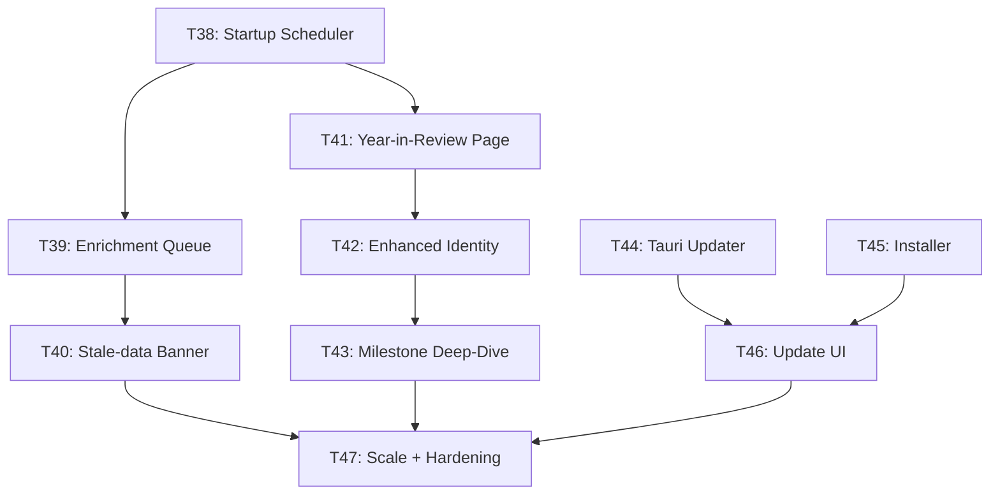

# Pirate Harbor — Phase 5 Implementation Plan

> **Phases 1–4:** ✅ Complete (60 tests, 0 warnings, 0 TSC errors)
> **Design System:** Atlas OS monochrome | **Convention:** `feat: T<N> - <desc>`

---

## Where We Stand After Phase 4

| Layer | Status |
|-------|--------|
| Core data model (games, sessions, collections, milestones, journal) | ✅ Complete |
| Scanner, launcher, metadata enrichment (RAWG) | ✅ Complete |
| Asset manager (covers, backgrounds, gallery, dedup) | ✅ Complete |
| Background job scheduler (priority queue, worker loop) | ✅ Complete |
| FTS5 full-text search (Cmd+K global overlay) | ✅ Complete |
| Analytics & metadata engines (stats, heatmap, year-in-review) | ✅ Complete |
| Recommendation engine (4 strategies, weighted combiner) | ✅ Complete |
| Data export (JSON + Markdown) | ✅ Complete |
| Local backup/restore (.phb ZIP format) | ✅ Complete |
| Game Detail (gallery, notes, related titles) | ✅ Complete |
| Settings (storage stats, diagnostics, integrity check) | ✅ Complete |
| UX polish (skeletons, a11y, keyboard nav, animations) | ✅ Complete |

**What is missing:**

1. **Auto-backup never triggers** — `AutoBackupJob` exists but is never scheduled at startup.
2. **Metadata refresh** — Library enrichment is manual only. Stale covers/genres are not refreshed.
3. **Year-in-Review UI** — Backend `build_year_in_review()` exists but there is no frontend page.
4. **Enhanced Identity page** — Activity heatmap, genre radar chart, and milestone timeline are not shown.
5. **Distribution** — No installer, no auto-updater, no signing. App cannot be shipped.
6. **Performance ceiling** — No stress test above 1000 games. No memory profiling.

---

## Phase 5 Overview (T38–T47)

### Pillar 1 — Live Platform Intelligence (T38–T40)
Make the platform feel alive and self-maintaining between user sessions.

### Pillar 2 — Identity & Year-in-Review Surfaces (T41–T43)
Wire the analytics engines to beautiful, data-rich UI screens.

### Pillar 3 — Distribution Readiness (T44–T46)
Package and ship as a real desktop application.

### Pillar 4 — Performance & Hardening (T47)
Prove correctness and performance at scale (5000+ games).

---

## Task Overview (T38–T47)

| Task | Description | Pillar | Est. |
|------|-------------|--------|------|
| **T38** | Startup auto-backup + scheduled metadata refresh | Intelligence | 1.5d |
| **T39** | Background enrichment queue (batch RAWG refresh) | Intelligence | 1.5d |
| **T40** | Stale-data detection + notification banner | Intelligence | 1d |
| **T41** | Year-in-Review page | Identity | 2d |
| **T42** | Enhanced Identity dashboard (heatmap, radar, timeline) | Identity | 2d |
| **T43** | Milestone deep-dive + streak engine | Identity | 1.5d |
| **T44** | Tauri updater + release signing | Distribution | 1d |
| **T45** | Windows installer (MSI/NSIS) + app icon | Distribution | 1d |
| **T46** | Update notification UI + changelog viewer | Distribution | 0.5d |
| **T47** | Scale testing (5000 games) + memory profiling | Hardening | 1.5d |

**Total: ~15 days**

---

## Dependency Graph



---

## Task Details

---

### T38 — Startup Auto-Backup + Scheduled Metadata Refresh

**Objective:** Wire `AutoBackupJob` and a new `MetadataRefreshJob` to run at
application startup if their intervals are due. Makes the platform self-healing.

**Files:**
- [MODIFY] `src-tauri/src/lib.rs`
  - After scheduler init, check `is_auto_backup_due()` — if true, enqueue `AutoBackupJob`
  - Check `is_metadata_refresh_due()` — if true, enqueue `MetadataRefreshJob`
- [NEW] `src-tauri/src/background/startup_jobs.rs`
  - `schedule_startup_jobs(conn, scheduler, app_data_dir)` — orchestrates all startup checks
  - `is_metadata_refresh_due(conn) -> bool` — compares `last_metadata_refresh_at` setting
- [MODIFY] `src-tauri/src/commands/settings.rs`
  - Expose `auto_backup_interval` and `metadata_refresh_interval` as user-configurable settings

**Settings keys used:**
```
auto_backup_interval   = "never" | "daily" | "weekly" | "monthly"
last_auto_backup_at    = RFC3339 timestamp
metadata_refresh_interval = "never" | "weekly" | "monthly"
last_metadata_refresh_at  = RFC3339 timestamp
```

**Verify:** Start app → auto-backup created if weekly interval exceeded.
Restart → backup is NOT created again (interval not exceeded).

---

### T39 — Background Enrichment Queue (Batch RAWG Refresh)

**Objective:** Re-enrich games whose metadata is older than the refresh
interval without blocking the user. Prioritize games with missing covers.

**Files:**
- [NEW] `src-tauri/src/background/enrichment_job.rs`

```rust
pub struct BulkEnrichmentJob {
    pub game_ids: Vec<String>,
    pub api_key: String,
}

impl Job for BulkEnrichmentJob {
    fn name(&self) -> &str { "bulk_enrich" }
    fn execute(&self, ctx: JobContext) -> Result<JobResult, String> {
        // For each game_id: call RAWG, update metadata, emit progress event
        // Rate-limit to 1 req/sec to stay within RAWG free tier (20k/month)
    }
}
```

- [MODIFY] `src-tauri/src/commands/metadata.rs`
  - Add `queue_enrichment_refresh(limit: usize)` — queues `BulkEnrichmentJob` for N stalest games
  - Add `get_enrichment_queue_status()` → `EnrichmentStatus { total, done, failed, running }`

**Rate limiting:** 1 request/second sleep between RAWG calls. Store
`metadata_enriched_at` per game to track staleness.

**Frontend:**
- [MODIFY] `SettingsPage.tsx` — "Refresh Metadata" button with progress bar
- [MODIFY] `TopBar.tsx` — Show enrichment job progress in the existing job indicator

**Verify:** Queue refresh for 10 games. Progress events arrive. Covers update
in Library without restart. Rate limit respected (no HTTP 429).

---

### T40 — Stale-Data Detection + Notification Banner

**Objective:** Inform the user when their library data needs attention —
missing covers, unenriched games, outdated backup.

**Files:**
- [NEW] `src-tauri/src/commands/health.rs`

```rust
#[derive(Serialize)]
pub struct LibraryHealthReport {
    pub games_missing_cover: i64,
    pub games_unenriched: i64,
    pub last_backup_days_ago: Option<i64>,
    pub backup_overdue: bool,
    pub unenriched_pct: f64,
}

#[tauri::command]
pub fn get_library_health(db: State<DbState>) -> Result<LibraryHealthReport, String>
```

- [NEW] `src/components/HealthBanner.tsx`
  - Dismissible warning strip shown below TopBar
  - "X games missing covers — Enrich Now" → triggers `queue_enrichment_refresh`
  - "No backup in 14 days — Back Up Now" → opens Settings backup section
  - Dismissed state persisted in `localStorage`

**Verify:** Add a game with no cover → banner appears. Enrich → banner dismisses.

---

### T41 — Year-in-Review Page

**Objective:** Annual summary page showing the highlights of a gaming year.
Backend (`build_year_in_review`) is already implemented — this is the UI.

**Route:** `/year-in-review/:year` (accessible from IdentityPage)

**Files:**
- [NEW] `src/pages/YearInReviewPage.tsx`

**Sections:**

| Section | Data Source |
|---------|-------------|
| Hero stat — total hours | `year_in_review.total_playtime_secs` |
| Games played vs completed | `year_in_review.games_played / games_completed` |
| Most active month | `year_in_review.most_active_month` (bar chart) |
| Top 3 games by playtime | `year_in_review.top_games` |
| Longest single session | `year_in_review.longest_session_secs` |
| New genres discovered | Compute from year's games vs prior library |
| Milestone count | `year_in_review.milestone_count` |
| Year picker (2023, 2024, 2025…) | Derived from `MIN(started_at)` in sessions |

**Design:** Full-screen editorial layout. Dark background, large typography.
Cinematic "wrapped" feel — no tables, data is rendered as bold callout blocks.

**Tauri commands used:**
- `get_year_in_review(year: String)` → already exists

**Frontend only — no new backend required.**

**Verify:** Select 2025 → correct stats shown. Year picker changes data.
Empty year shows graceful empty state.

---

### T42 — Enhanced Identity Dashboard

**Objective:** Upgrade `IdentityPage.tsx` with the three missing data panels
that the analytics engines (T30) already power.

**New panels to add:**

#### Activity Heatmap
- 7-row × 24-col grid (day × hour)
- Cell color = session count intensity (monochrome, 5 shades)
- Tooltip: "N sessions on {Day} at {Hour}:00"
- Data: `get_activity_heatmap()` → already exists

#### Genre Radar Chart
- SVG radar/spider chart (pure SVG, no charting library dependency)
- Axes = top 6 genres, radius = total playtime in that genre
- Data: `get_genre_distribution()` → already exists

#### Milestone Timeline
- Vertical chronological strip of the last 12 milestones
- Each entry: milestone icon, title, game name, date
- Link to full Milestones page
- Data: `get_milestones(limit: 12)` → already exists

**Files:**
- [MODIFY] `src/pages/IdentityPage.tsx` — Add three new sections
- [NEW] `src/components/ActivityHeatmap.tsx`
- [NEW] `src/components/GenreRadarChart.tsx`

**No new backend commands required.**

**Verify:** 100+ sessions → heatmap populates. 3+ genres → radar renders.
12 milestones → timeline shows correctly.

---

### T43 — Milestone Deep-Dive + Streak Engine

**Objective:** Add gaming streak tracking and a dedicated milestone statistics
view that gives players a sense of achievement progression.

**Streak definition:** Consecutive calendar days with ≥1 play session.

**Files:**
- [NEW] `src-tauri/src/analytics/streaks.rs`

```rust
pub struct StreakStats {
    pub current_streak_days: i64,
    pub longest_streak_days: i64,
    pub streak_start_date: Option<String>,
}

pub fn calculate_streaks(conn: &Connection) -> Result<StreakStats, String>
```

- [MODIFY] `src-tauri/src/commands/analytics.rs`
  - Add `get_streak_stats()` → `StreakStats`
- [MODIFY] `src/pages/MilestonesPage.tsx`
  - Add streak display: "🔥 {N} day streak" hero card
  - Add milestone category breakdown (pie/bar by category)
  - Add "Total points earned" tally

**Verify:** Play sessions on 3 consecutive days → current streak = 3.
Break streak → current = 0, longest retained.

---

### T44 — Tauri Updater + Release Signing

**Objective:** Enable in-app update delivery using Tauri's built-in updater plugin.

**Files:**
- [MODIFY] `src-tauri/tauri.conf.json`
  - Enable `"updater"` plugin with `pubkey` and `endpoints` configured
- [MODIFY] `Cargo.toml`
  - Add `tauri-plugin-updater = "2"`
- [NEW] `src-tauri/src/commands/updater.rs`

```rust
#[tauri::command]
pub async fn check_for_update(app: tauri::AppHandle) -> Result<Option<UpdateInfo>, String>

#[tauri::command]
pub async fn install_update(app: tauri::AppHandle) -> Result<(), String>

#[derive(Serialize)]
pub struct UpdateInfo {
    pub version: String,
    pub release_date: String,
    pub body: String,      // Changelog markdown
    pub download_size_bytes: Option<u64>,
}
```

**Signing:** Generate Ed25519 keypair with `tauri signer generate`. Store
private key as GitHub Actions secret `TAURI_SIGNING_PRIVATE_KEY`.

**Update server:** Host `latest.json` on GitHub Releases:
```json
{
  "version": "0.2.0",
  "notes": "Changelog text",
  "pub_date": "2025-01-01T00:00:00Z",
  "platforms": {
    "windows-x86_64": {
      "signature": "...",
      "url": "https://github.com/.../releases/download/v0.2.0/app_0.2.0_x64-setup.exe"
    }
  }
}
```

**Verify:** Bump version → `check_for_update` returns `Some(UpdateInfo)`.
Install → app restarts at new version.

---

### T45 — Windows Installer (MSI/NSIS) + App Icon

**Objective:** Produce a distributable Windows installer and set the Pirate
Harbor app icon.

**Files:**
- [NEW] `src-tauri/icons/` — Full icon set generated from source SVG
  - `32x32.png`, `128x128.png`, `128x128@2x.png`, `icon.ico`, `icon.icns`
- [MODIFY] `src-tauri/tauri.conf.json`
  - `bundle.icon` paths
  - `bundle.windows.nsis` or `bundle.windows.msi` configuration
  - `bundle.identifier = "com.pirateharbor.app"`
  - `bundle.publisher`, `bundle.shortDescription`, `bundle.longDescription`
- [NEW] `.github/workflows/release.yml`
  - Triggered on `push --tag "v*.*.*"`
  - Builds for `windows-latest`
  - Uploads `.exe` and `.msi` artifacts to GitHub Release

**Icon design:** Skull + anchor + game controller silhouette — matches Atlas OS
monochrome aesthetic. Generate with `generate_image` tool.

**Verify:** `cargo tauri build` produces `.msi` and `.exe`. Installer runs on
Windows 10+. App appears in Add/Remove Programs with correct metadata.

---

### T46 — Update Notification UI + Changelog Viewer

**Objective:** Surface available updates to the user gracefully without
interrupting their gaming session.

**Files:**
- [NEW] `src/components/UpdateBanner.tsx`
  - Dismissible banner shown in Settings page when update available
  - Shows: new version number, release date, download size
  - "Install & Restart" button → calls `install_update()`
  - "View Changelog" → expands Markdown changelog inline
- [MODIFY] `src/pages/SettingsPage.tsx`
  - Replace "Check for Updates (Coming in Phase 5)" placeholder
  - Wire `check_for_update()` to "Check Now" button
  - Show `UpdateBanner` when update is available
- [MODIFY] `src/lib/api.ts`
  - Add `checkForUpdate()`, `installUpdate()` bindings

**Verify:** Mock a newer version in `latest.json` → banner appears. "Install"
triggers updater. Changelog renders Markdown correctly.

---

### T47 — Scale Testing + Memory Profiling

**Objective:** Prove correctness and performance with 5000+ games. Identify
and fix any N+1 queries or memory leaks introduced in Phases 1–5.

**Files:**
- [MODIFY] `src-tauri/src/tests/integration.rs`
  - Add `t47_library_5000_games_loads_under_2s` test
  - Add `t47_fts5_search_sub_50ms_on_5000_games` test
  - Add `t47_recommendations_sub_200ms_on_5000_games` test
  - Add `t47_backup_5000_games_creates_valid_archive` test
  - Add `t47_export_json_5000_games_produces_valid_json` test

**Performance targets:**

| Operation | Limit |
|-----------|-------|
| Library page load (5000 games) | < 2s |
| FTS5 search (5000 games) | < 50ms |
| Recommendation scoring (5000 candidates) | < 200ms |
| Backup creation (5000 games, no images) | < 5s |
| JSON export (5000 games) | < 3s |

**Memory check:** Run app with 5000 games for 10 minutes. Confirm memory does
not grow unboundedly (no Arc/Mutex leaks from background workers).

**Verify:** All 5 new performance tests pass on a cold debug build. 0 new
warnings introduced. Final test count ≥ 65.

---

## Implementation Order

| Week | Tasks | Focus |
|------|-------|-------|
| 1 | T38, T39, T40 | Startup intelligence, enrichment queue, health banner |
| 2 | T41, T42, T43 | Year-in-Review, Enhanced Identity, Streaks |
| 3 | T44, T45, T46 | Updater, installer, update UI |
| 4 | T47 | Scale testing, hardening, final QA |

---

## New Module Map (Phase 5 additions only)

```
src-tauri/src/
├── analytics/
│   └── streaks.rs              (NEW T43)
├── background/
│   └── startup_jobs.rs         (NEW T38)
│       enrichment_job.rs       (NEW T39)
├── commands/
│   ├── health.rs               (NEW T40)
│   └── updater.rs              (NEW T44)
└── ...

src/
├── components/
│   ├── ActivityHeatmap.tsx     (NEW T42)
│   ├── GenreRadarChart.tsx     (NEW T42)
│   ├── HealthBanner.tsx        (NEW T40)
│   └── UpdateBanner.tsx        (NEW T46)
└── pages/
    └── YearInReviewPage.tsx    (NEW T41)
```

---

## Open Questions

> [!IMPORTANT]
> **1. Update server hosting:** Where should `latest.json` be hosted?
> GitHub Releases is simplest (free, reliable). An alternative is a custom
> endpoint on Vercel/Cloudflare Workers. Recommendation: **GitHub Releases**.

> [!IMPORTANT]
> **2. Code signing certificate:** Windows Defender will flag unsigned `.exe`
> installers with a SmartScreen warning. An EV Code Signing cert costs ~$300/yr.
> Without it, users must click "Run anyway". Accept this for v1.0 or budget for cert?

> [!IMPORTANT]
> **3. RAWG API rate limit for T39:** RAWG free tier allows 20,000 req/month.
> At 1 req/sec, 5000 games = 5000 requests per full refresh. This consumes 25%
> of the monthly quota in a single run. Should we limit batch refresh to
> **games with no cover** only, or allow full library refresh?

> [!NOTE]
> **4. Year-in-Review year picker:** The earliest possible year is derived from
> the user's first session. If the user has no sessions (new user), the page
> should show the current year with empty-state messaging rather than crashing.
